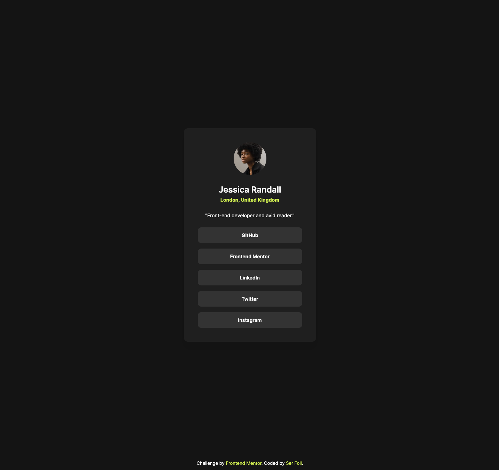
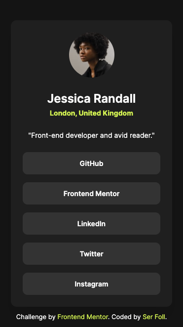

<!-- @format -->

# Frontend Mentor - Social links profile solution

This is a solution to the [Social links profile challenge on Frontend Mentor](https://www.frontendmentor.io/challenges/social-links-profile-UG32l9m6dQ). Frontend Mentor challenges help you improve your coding skills by building realistic projects.

## Table of contents

- [Frontend Mentor - Social links profile solution](#frontend-mentor---social-links-profile-solution)
  - [Table of contents](#table-of-contents)
  - [Overview](#overview)
    - [The challenge](#the-challenge)
    - [Screenshot](#screenshot)
      - [Desktop](#desktop)
      - [Mobile](#mobile)
    - [Links](#links)
  - [My process](#my-process)
    - [Built with](#built-with)
    - [What I learned](#what-i-learned)
    - [Useful resources](#useful-resources)
  - [Author](#author)

## Overview

### The challenge

Users should be able to:

- See hover and focus states for all interactive elements on the page

### Screenshot

#### Desktop

#### Mobile

### Links

- Solution URL: [Github](https://github.com/serfoll/social-links-profile)
- Live Site URL: [Netlify](https://serfoll-social-links-profile.netlify.app)

## My process

### Built with

- Semantic HTML5 markup
- CSS custom properties
- Flexbox
- Mobile-first workflow

### What I learned

- Working with designs without a figma/sketch file.
- Quick prototyting and testing ideas inside the browser using the devtools.

### Useful resources

- [Smooth shadow generator](https://smoothshadows.com) - This helped me save time when creating the perfect shadow-box.
- [Perfect Pixel](https://www.welldonecode.com/perfectpixel/) - This helped me get the design as accurate as possible without having access to the figma design file.

## Author

- Frontend Mentor - [@serfoll](https://www.frontendmentor.io/profile/serfoll)
- X/Twitter - [@sergiofol](https://www.twitter.com/sergiofol)
